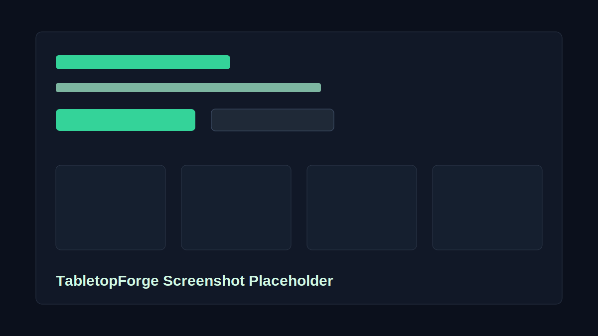

# TabletopForge



TabletopForge is an incident response tabletop exercise generator for small businesses, MSPs, IT teams, and cybersecurity students. It creates practical, non-technical tabletop packages that expose gaps in an organization's Incident Response Plan without requiring complex injects or paid APIs.

Tagline: "Simple incident response tabletop exercises for real-world readiness."

## Features

- Scenario builder for phishing/BEC, ransomware, data exfiltration, compromised admin accounts, lost laptops, vendor breaches, insider threats, and cloud misconfiguration
- Organization profile fields for industry, size, maturity level, duration, and optional question sets
- Realistic scenario summaries, objectives, suggested participants, discussion questions, IRP gap-discovery questions, expected decisions, facilitator notes, and executive summaries
- Local IRP upload or paste analysis that adjusts tabletop questions around likely plan gaps
- Optional lessons-learned template with action item, owner, due date, and priority prompts
- Copyable and downloadable Markdown reports
- Browser-based saved exercises with LocalStorage
- Responsive dark GRC dashboard interface built with shadcn/ui-style components

## Tech Stack

- Next.js 15
- TypeScript
- Tailwind CSS
- shadcn/ui-style components
- App Router
- LocalStorage
- Local browser-only IRP text analysis

## Run Locally

```bash
npm install
npm run dev
```

Open `http://localhost:3000`.

## Build And Lint

```bash
npm run lint
npm run build
```

## Example Use Cases

- A small business wants to test who receives and escalates a suspicious email report.
- An MSP wants a simple ransomware tabletop for a client leadership team.
- A cybersecurity student wants a realistic IR planning artifact for a portfolio.
- An IT manager wants to discover missing communication templates and unclear containment authority.
- A security lead wants to upload an IRP excerpt and generate questions that target missing severity, communications, containment, evidence, or recovery procedures.

## Resume Bullet

"Built TabletopForge, a full-stack incident response tabletop exercise generator that creates scenario-based discussion guides, IRP gap-discovery questions, executive summaries, and lessons-learned templates for cybersecurity readiness planning."

## Future Improvements

- PDF export
- Custom scenario authoring
- AI-assisted IRP interpretation and facilitator injects
- Exercise scoring and maturity recommendations
- Shared team workspaces
- More compliance-specific report templates
- Import/export saved exercise library

## Disclaimer

TabletopForge does not replace professional legal, compliance, cybersecurity, or incident response advice. Use it as a readiness planning aid and validate decisions with qualified advisors.
